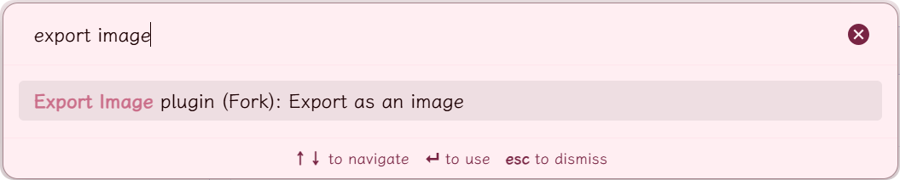
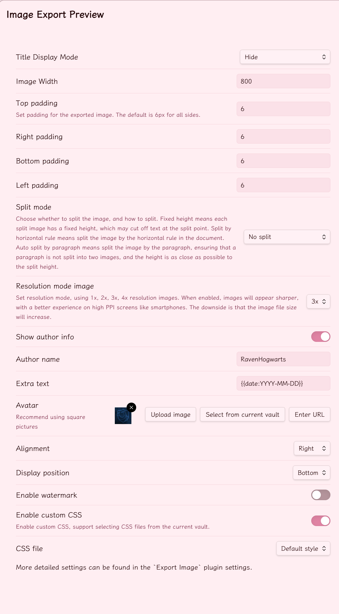

> [!NOTE]
> This is a fork of [zhouhua/obsidian-export-image](https://github.com/zhouhua/obsidian-export-image).
>
> **Important:** This fork uses a different plugin ID (`obsidian-export-image-fork`), so it is treated as a separate plugin. Your settings from the original plugin will **not** be inherited, so you will need to re-configure them after installation.

# Obsidian Export Image Plugin

 

This Obsidian plugin can easily help you export any article as an image.

## Features Diffs

Based on the original version, the following features have been added or optimized:

- Support user-defined CSS to freely load and use different export styles.
- Support customizing how the title is displayed in the exported image.
- Support processing Obsidian templates in author information and remarks.
- Optimized settings interface and preview interaction for a better user experience.
- Only English and Chinese translations are retained.

View the [diff comparison](https://github.com/RavenHogwarts/obsidian-export-image/compare/d8b16f5a4de19df79f28a5f635797b3c1bd71e0f...dev) for detailed code changes.

## Usage

Use the command `export as a image` in command palette (Press cmd/ctrl+P to enter the command) to generate a image. You can download it to your file system, or copy to clipboard.





Also, you can access this function from the editor menu:


> [!NOTE]
> Due to device limitations, exporting images on mobile can only be saved to the current vault.

## Installation

### Install via BRAT

1. Install [**Obsidian42 - BRAT**](https://obsidian.md/plugins?id=obsidian42-brat) from the Community Plugins.
2. Open the command palette (`Ctrl/Cmd + P`) and execute the command `BRAT: Add a beta plugin for testing`.
3. Enter the following repository URL: `RavenHogWarts/obsidian-export-image`.
4. Click **Add Plugin**.
5. In **Community Plugins**, enable the **Export Image** plugin.

## Custom Styles

To help experienced users write their own CSS styles, here is the combined DOM structure of the exported image.

```html
<!-- Export Image Root -->
<div class="export-image-root markdown-reading-view">
  <!-- Watermark Container -->
  <div class="export-image-preview-container">
    <!-- Inline Title -->
    <div class="inline-title"></div>
    <!-- Metadata -->
    <div class="metadata-container">
      <div class="metadata-content">
        <!-- Metadata Items -->
        <div class="metadata-property">
          <!-- Metadata Key -->
          <div class="metadata-property-key">
            <!-- Metadata Icon -->
            <span class="metadata-property-icon"></span>
            <!-- Metadata Name -->
            <span class="metadata-property-name"></span>
          </div>
          <!-- Metadata Value -->
          <div class="metadata-property-value"></div>
        </div>
      </div>
    </div>

    <!-- Note Content -->
    <div>...</div>
  </div>

  <!-- Author Info -->
  <div class="user-info-container">
    <!-- Author Avatar -->
    <div class="user-info-avatar"></div>
    <div>
      <!-- Author Name -->
      <div class="user-info-name"></div>
      <!-- Extra Info -->
      <div class="user-info-remark"></div>
    </div>
  </div>
</div>
```

## Star History

<a href="https://star-history.com/#RavenHogwarts/obsidian-export-image&Date">
 <picture>
   <source media="(prefers-color-scheme: dark)" srcset="https://api.star-history.com/svg?repos=RavenHogwarts/obsidian-export-image&type=Date&theme=dark" />
   <source media="(prefers-color-scheme: light)" srcset="https://api.star-history.com/svg?repos=RavenHogwarts/obsidian-export-image&type=Date" />
   
 </picture>
</a>

## Special Thanks

- [dom-to-image](https://github.com/tsayen/dom-to-image) & [dom-to-image-more](https://github.com/1904labs/dom-to-image-more). This repo borrows lots of code from [dom-to-image-more](https://github.com/1904labs/dom-to-image-more). The amazing lib helps me generate images from dom.
