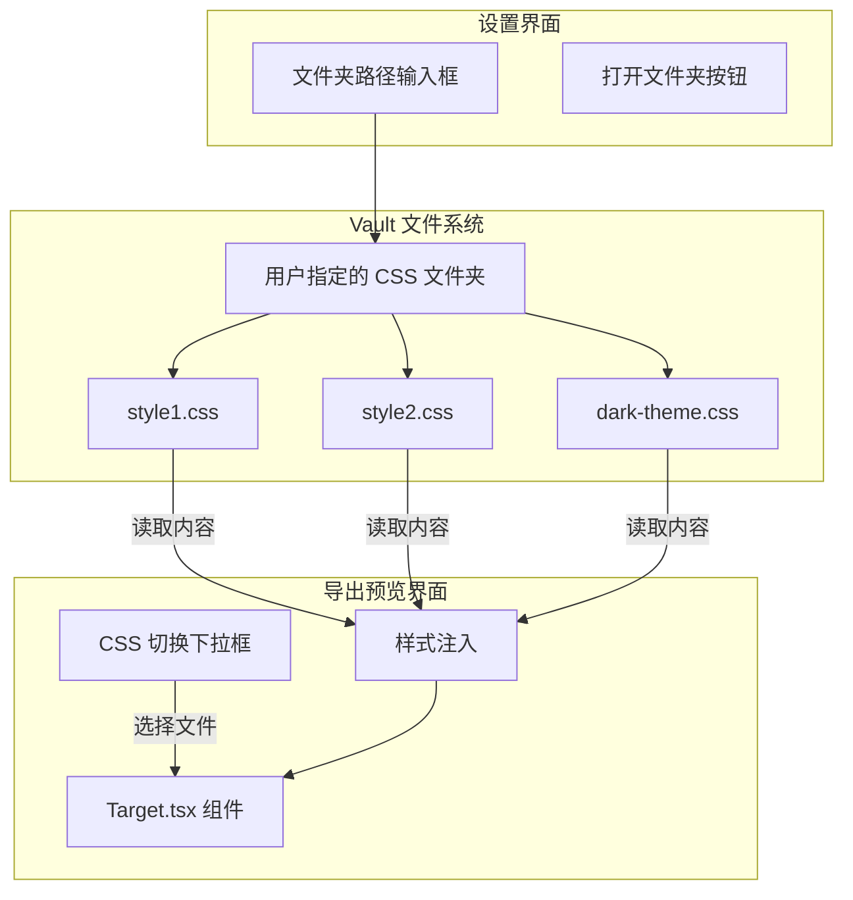

# 自定义 CSS 功能实现方案

## 1. 功能概述

实现在导出图片时加载用户自定义的 CSS 样式，并支持在导出预览界面自由切换。

### 核心需求

1. **CSS 文件夹管理**：用户在设置中指定一个 Vault 内的文件夹路径，插件从中读取 `.css` 文件
2. **实时预览**：在导出弹窗中可以实时切换不同的 CSS 样式
3. **样式应用**：选中的 CSS 将在导出时注入到渲染的内容中

---

## 2. 技术方案设计

### 2.1 数据结构设计

```typescript
// 在 src/type.d.ts 中更新 ISettings

declare type ISettings = {
  // ... 现有字段 ...
  
  /** 自定义 CSS 配置 */
  customCSS: {
    /** CSS 文件夹路径（相对于 Vault 根目录） */
    folder: string;
    /** 当前选中的 CSS 文件名（导出时使用） */
    activeFile: string | null;
  };
};
```

### 2.2 运行时数据结构

```typescript
// CSS 文件信息（运行时加载，不存储在 settings 中）
interface CSSFileInfo {
  /** 文件名（不含路径） */
  name: string;
  /** 完整路径 */
  path: string;
  /** CSS 内容（按需加载） */
  content?: string;
}
```

### 2.3 架构图



---

## 3. 修改文件清单

### 3.1 类型定义

#### [MODIFY] [type.d.ts](file:///e:/WorkSpace/GitProgram/Contribute/obsidian-export-image/src/type.d.ts)

新增 `ISettings.customCSS` 字段：

```diff
 declare type ISettings = {
   // ... 现有字段 ...
+  customCSS: {
+    folder: string;
+    activeFile: string | null;
+  };
 };
```

---

### 3.2 默认设置

#### [MODIFY] [settings.ts](file:///e:/WorkSpace/GitProgram/Contribute/obsidian-export-image/src/settings.ts)

添加 `customCSS` 的默认值：

```diff
 export const DEFAULT_SETTINGS: ISettings = {
   // ... 现有设置 ...
+  customCSS: {
+    folder: '',
+    activeFile: null,
+  },
 };
```

---

### 3.3 国际化支持

#### [MODIFY] [src/i18n/en/index.ts](file:///e:/WorkSpace/GitProgram/Contribute/obsidian-export-image/src/i18n/en/index.ts)

添加 `customCSS` 相关翻译：

```typescript
setting: {
  // ... 现有翻译 ...
  customCSS: {
    title: 'Custom CSS',
    folder: {
      label: 'CSS folder path',
      description: 'Specify a folder path in your vault containing .css files for export styling.',
      placeholder: 'e.g., assets/export-css',
    },
    openFolder: 'Open folder',
    noFolder: 'No CSS folder specified',
    folderNotFound: 'Folder not found: {path}',
    noFiles: 'No .css files found in the specified folder',
  },
},
// 导出预览界面
selectCSS: 'Export style',
defaultStyle: 'Default (no custom CSS)',
```

---

### 3.4 CSS 文件读取工具

#### [NEW] [src/utils/cssLoader.ts](file:///e:/WorkSpace/GitProgram/Contribute/obsidian-export-image/src/utils/cssLoader.ts)

创建 CSS 文件加载工具函数：

```typescript
import { App, TFile, TFolder, normalizePath } from 'obsidian';

export interface CSSFileInfo {
  name: string;
  path: string;
}

/**
 * 获取指定文件夹中的所有 CSS 文件
 */
export async function getCSSFiles(app: App, folderPath: string): Promise<CSSFileInfo[]> {
  if (!folderPath) return [];
  
  const normalizedPath = normalizePath(folderPath);
  const folder = app.vault.getAbstractFileByPath(normalizedPath);
  
  if (!(folder instanceof TFolder)) return [];
  
  const cssFiles: CSSFileInfo[] = [];
  
  for (const child of folder.children) {
    if (child instanceof TFile && child.extension === 'css') {
      cssFiles.push({
        name: child.basename,
        path: child.path,
      });
    }
  }
  
  return cssFiles.sort((a, b) => a.name.localeCompare(b.name));
}

/**
 * 读取 CSS 文件内容
 */
export async function readCSSFile(app: App, filePath: string): Promise<string> {
  const file = app.vault.getAbstractFileByPath(filePath);
  if (!(file instanceof TFile)) return '';
  return app.vault.read(file);
}
```

---

### 3.5 设置表单配置

#### [MODIFY] [src/formConfig.ts](file:///e:/WorkSpace/GitProgram/Contribute/obsidian-export-image/src/formConfig.ts)

在设置项末尾添加 CSS 文件夹配置：

```typescript
{
  id: 'customCSS.folder',
  label: L.setting.customCSS.folder.label(),
  description: L.setting.customCSS.folder.description(),
  type: 'text',
  placeholder: L.setting.customCSS.folder.placeholder(),
},
```

---

### 3.6 导出预览界面集成

#### [MODIFY] [src/components/file/ModalContent.tsx](file:///e:/WorkSpace/GitProgram/Contribute/obsidian-export-image/src/components/file/ModalContent.tsx)

添加 CSS 选择下拉框：

1. 使用 `useEffect` 在组件挂载时加载 CSS 文件列表
2. 渲染下拉框供用户选择
3. 选择变化时更新 `settings.customCSS.activeFile`

```tsx
// 状态
const [cssFiles, setCssFiles] = useState<CSSFileInfo[]>([]);
const [activeCSS, setActiveCSS] = useState<string | null>(settings.customCSS.activeFile);

// 加载 CSS 文件列表
useEffect(() => {
  getCSSFiles(app, settings.customCSS.folder).then(setCssFiles);
}, [settings.customCSS.folder]);

// 渲染下拉框
<select value={activeCSS || ''} onChange={e => setActiveCSS(e.target.value || null)}>
  <option value="">{L.defaultStyle()}</option>
  {cssFiles.map(file => (
    <option key={file.path} value={file.path}>{file.name}</option>
  ))}
</select>
```

---

### 3.7 样式注入

#### [MODIFY] [src/components/common/Target.tsx](file:///e:/WorkSpace/GitProgram/Contribute/obsidian-export-image/src/components/common/Target.tsx)

新增 Props 接收自定义 CSS 内容，并在渲染时注入：

```diff
 interface TargetProps {
   // ... 现有 props ...
+  customCSS?: string;
 }

 const Target = forwardRef<TargetRef, TargetProps>(
-  ({ frontmatter, setting, title, ... }, ref) => {
+  ({ frontmatter, setting, title, customCSS, ... }, ref) => {

   return (
     <div ref={clipRef}>
+      {customCSS && <style>{customCSS}</style>}
       <div className={clsx('export-image-root markdown-reading-view', ...)}>
         {/* ... 现有渲染内容 ... */}
       </div>
     </div>
   );
 });
```

---

## 4. 实现优先级

| 阶段 | 任务 | 文件 |
|------|------|------|
| 1 | 类型定义和默认设置 | `type.d.ts`, `settings.ts` |
| 2 | 国际化文本 | `i18n/en/index.ts`, `i18n/zh/index.ts` |
| 3 | CSS 文件读取工具 | `utils/cssLoader.ts` **[新增]** |
| 4 | 设置页面文件夹路径配置 | `formConfig.ts` |
| 5 | 导出预览界面 CSS 切换 | `ModalContent.tsx` |
| 6 | Target.tsx 样式注入 | `Target.tsx` |

---

## 5. 验证计划

### 手动测试步骤

1. 在 Vault 中创建文件夹 `assets/export-css/`
2. 在该文件夹中创建测试 CSS 文件：

   **purple-gradient.css**
   ```css
   .export-image-root {
     background: linear-gradient(135deg, #667eea 0%, #764ba2 100%) !important;
   }
   .export-image-root h1,
   .export-image-root h2,
   .export-image-root p {
     color: white !important;
   }
   ```

   **minimal-dark.css**
   ```css
   .export-image-root {
     background: #1a1a2e !important;
     color: #eee !important;
   }
   ```

3. 打开 Obsidian 设置 → Export Image → 设置 CSS folder 为 `assets/export-css`
4. 打开任意 Markdown 文件，右键 → Export to image
5. 在预览弹窗中，从 CSS 下拉框选择 `purple-gradient`
6. 确认预览区域的背景变为紫色渐变
7. 切换到 `minimal-dark`，确认预览更新为深色背景
8. 选择 "Default"，确认恢复默认样式
9. 点击保存，确认导出的图片应用了选中的样式

---

## 6. 注意事项

> [!IMPORTANT]
> **CSS 作用域**
> 自定义 CSS 应仅作用于 `.export-image-root` 内部。建议在文档或 UI 中提示用户使用 `.export-image-root` 前缀选择器。

> [!TIP]
> **用户体验**
> 可以在设置页面添加 "Open folder" 按钮，方便用户快速跳转到 CSS 文件夹进行编辑。

---

*文档更新时间: 2025-12-25*
