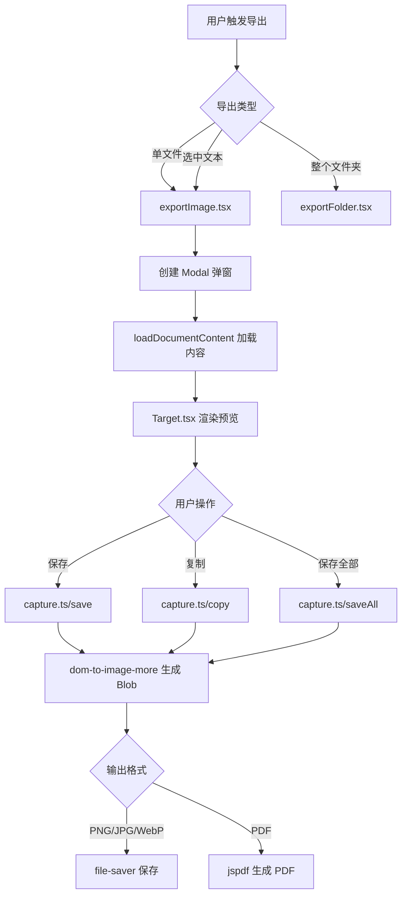

# obsidian-export-image 开发文档

## 项目概述

这是一个 Obsidian 插件，用于将 Markdown 笔记导出为图片。支持多种导出格式（PNG、JPG、WebP、PDF），并提供水印、作者信息、分页分割等高级功能。

---

## 技术栈

| 类别 | 技术 |
|------|------|
| 语言 | TypeScript 5.7 |
| UI 框架 | React 19 |
| 构建工具 | esbuild |
| 代码规范 | ESLint + XO |
| 国际化 | typesafe-i18n |
| 核心依赖 | dom-to-image-more、jspdf、jszip、file-saver |

---

## 项目结构

```
obsidian-export-image/
├── main.ts                   # 入口文件（重定向到 src）
├── src/
│   ├── ExportImagePlugin.ts  # 插件主类，注册命令和菜单
│   ├── settings.ts           # 默认设置和格式列表
│   ├── SettingRenderer.ts    # 设置页面渲染器
│   ├── formConfig.ts         # 设置表单配置生成
│   ├── L.ts                  # 国际化快捷引用
│   ├── type.d.ts             # 全局类型定义
│   ├── dom-to-image-more.js  # DOM 转图片库（本地修改版）
│   │
│   ├── components/
│   │   ├── common/           # 通用组件
│   │   │   ├── Target.tsx    # 导出目标渲染（含水印、作者信息）
│   │   │   ├── Metadata.tsx  # 元数据渲染组件
│   │   │   ├── imageSelectModal.tsx  # 图片选择弹窗
│   │   │   └── form/         # 表单组件
│   │   ├── file/             # 单文件导出
│   │   │   ├── exportImage.tsx   # 导出入口函数
│   │   │   └── ModalContent.tsx  # 预览弹窗内容
│   │   └── folder/           # 批量导出
│   │       ├── exportFolder.tsx  # 文件夹导出入口
│   │       └── ModalContent.tsx  # 批量导出弹窗
│   │
│   ├── utils/
│   │   ├── capture.ts        # 核心截图逻辑（save/copy/saveAll）
│   │   ├── split.ts          # 长图分割算法
│   │   ├── makeHTML.tsx      # 生成导出用 HTML
│   │   ├── preprocessMarkdown.ts  # Markdown 预处理
│   │   └── index.ts          # 工具函数集合
│   │
│   ├── i18n/                 # 国际化文件（20种语言）
│   │   ├── en/               # 英语（基础语言）
│   │   ├── zh/               # 中文
│   │   └── ...               # 其他语言
│   │
│   └── imageFormatTester/    # 图片格式支持检测
│
├── styles.css                # 插件样式
├── manifest.json             # Obsidian 插件清单
├── versions.json             # 版本兼容性记录
├── esbuild.config.mjs        # 构建配置
└── .github/workflows/        # CI/CD 配置
```

---

## 核心流程

### 1. 导出图片流程



### 2. 分页分割逻辑

当文章过长时，可按以下模式分割：
- **none**: 不分割
- **fixed**: 固定高度分割
- **hr**: 按分隔线 `---` 分割
- **auto**: 自动在合适位置分割（避免切断内容）

实现在 `src/utils/split.ts` 中。

---

## 开发环境搭建

### 1. 克隆并安装依赖

```bash
git clone <repository>
cd obsidian-export-image
pnpm install
```

### 2. 开发模式

```bash
pnpm run dev
```

此命令会监听文件变化并自动重新构建 `main.js`。

### 3. 构建生产版本

```bash
pnpm run build
```

### 4. 运行 Lint 检查

```bash
pnpm run lint
# 自动修复
pnpm run lint-fix
```

### 5. 国际化更新

```bash
pnpm run typesafe-i18n
```

修改 `src/i18n/en/index.ts`（基础语言）后运行此命令，会自动更新类型定义。

---

## 继续开发指南

### 添加新功能

1. **新增设置项**
   - 在 `src/type.d.ts` 中更新 `ISettings` 类型
   - 在 `src/settings.ts` 中添加默认值
   - 在 `src/formConfig.ts` 中添加表单配置

2. **新增组件**
   - 在 `src/components/common/` 下创建通用组件
   - 在 `Target.tsx` 中引入并渲染

3. **新增导出格式**
   - 在 `src/settings.ts` 的 `formatList` 中添加
   - 在 `src/utils/capture.ts` 的 `save` 函数中处理

4. **新增语言支持**
   - 在 `src/i18n/` 下创建语言文件夹
   - 实现 `index.ts` 导出翻译对象
   - 在 `src/i18n/i18n-util.ts` 中注册

### 关键注意事项

> [!IMPORTANT]
> **DOM 到图片的限制**
> - `dom-to-image-more` 无法处理跨域资源，远程图片需通过 `requestUrl` 代理
> - 某些 CSS 特性（如 `backdrop-filter`）可能无法正确渲染

> [!WARNING]
> **移动端限制**
> - 移动端无法使用 `file-saver`，只能保存到 Vault
> - 复制到剪贴板功能依赖 `navigator.clipboard.write`

> [!CAUTION]
> **性能考虑**
> - 导出大文件时需注意内存占用
> - 多倍分辨率（3x、4x）会显著增加渲染时间和文件大小

### 调试技巧

1. **查看 Obsidian 控制台**：`Ctrl+Shift+I` 打开开发者工具

2. **临时禁用压缩**：修改 `esbuild.config.mjs` 中 `minify: false`

3. **检查导出 HTML 结构**：在 `loadDocumentContent` 函数中查看生成的 HTML

---

## 发布流程

1. 更新 `package.json` 中的版本号
2. 运行 `pnpm run version` 更新 `manifest.json` 和 `versions.json`
3. 提交并创建 Git tag：`git tag -a X.Y.Z -m "Release X.Y.Z"`
4. 推送 tag：`git push origin X.Y.Z`
5. GitHub Actions 会自动创建 Release

---

## 常见问题

### Q: 为什么导出的图片文字模糊？
A: 检查 `resolutionMode` 设置，使用 `2x` 或 `3x` 可提高清晰度。

### Q: 为什么某些图片无法导出？
A: 可能是跨域问题。项目使用 `requestUrl` 代理远程图片，但某些服务可能拒绝请求。

### Q: 如何添加自定义样式？
A: 修改 `styles.css` 或在 `loadDocumentContent` 函数中注入样式。

---

## 贡献指南

1. Fork 仓库并创建功能分支
2. 确保代码通过 `pnpm run lint`
3. 编写清晰的提交信息
4. 提交 Pull Request

---

*最后更新: 2025-12-25*
